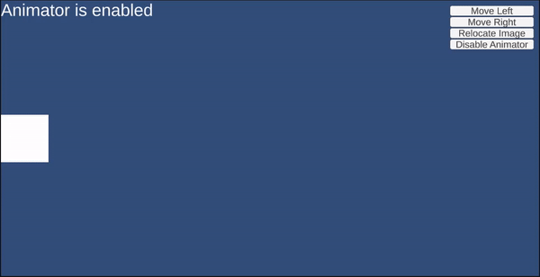

# unity-animator-resetting-position

Minimal repro project for https://gamedev.stackexchange.com/q/205813/8792

## Reproduction sample

## Problem

When the animator component (attached to the Image object) is enabled, trying to change the `transform.position` of the object doesn't work as expected (in this example, only the Y component is affected; the X component is not). However, when the animator component is disabled, the image object position can be changed by script as expected.

As suggested in [this answer](https://gamedev.stackexchange.com/a/196918/8792), the **Animator Write Defaults** have been set to `false`. This does not appear to make a difference, however.

## Expected behaviour

It should be possible to change the object's position through a script as expected, as well as being able to animate the object.
